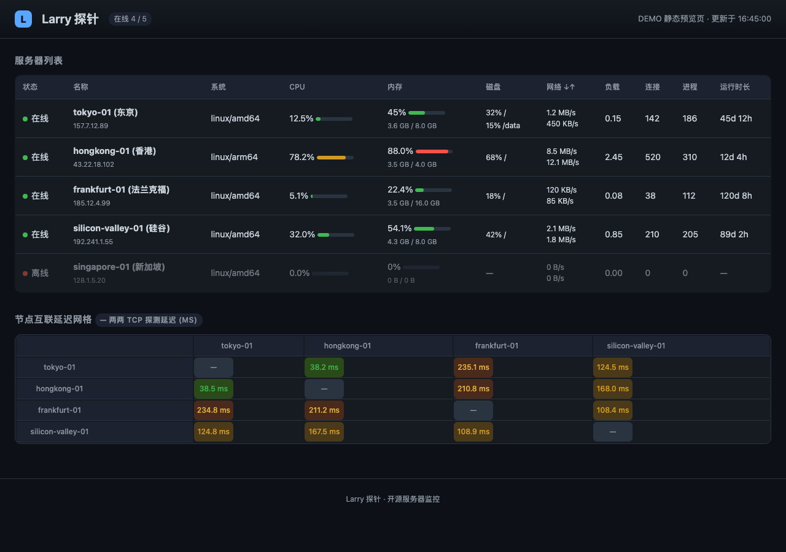

<div align="center">

# 🛰️ Larry 探针 (Larry Probe)

**极致轻量 · 高实时 · 带节点互测延迟（Mesh）的 Go 多节点服务器监控**

[](https://go.dev/dl/)
[](LICENSE)
[](https://github.com/larryworkerone/larry/pulls)

</div>

---

## 🧭 这是什么

**Larry 探针** 是一套自托管的轻量服务器监控：一个随时汇报状态的 `larry-agent` + 一个可嵌入 Web 界面的 `larry-server`。Agent 用 Go 单文件静态编译，通过 **WebSocket** 持续上报 CPU / 内存 / 磁盘 / 网络 / 负载 / TCP 连接 / 进程 / 温度等指标。

不同于多数探针（Nezha、Komari 只展示单机自己），Larry 还有一个**节点互测（Mesh）特性**：server 会让每个在线 agent 去测到其余在线 agent 的 TCP 往返延迟，构建一张「谁到谁延迟多少」的互通矩阵——这对多机房、跨国 VPS 排障尤其有用。

> 目标场景：一队 1 核 512MB 的小鸡 / 家用 NAT 机 / 跨国 VPS，在同一个内网或者公网上彼此互联监控。

---

## 📸 界面预览



> 上图由仓库根目录的 [`demo.html`](demo.html)（独立静态预览页）渲染而来；
> 实际部署后，Web 大盘会展示同样的深色主题、服务器列表与节点互通延迟矩阵（数据为实时 WebSocket 推送）。

---

## ✨ 功能特性

- ⚡ **极致轻量**：`CGO_ENABLED=0` 静态编译，Agent 无需 libc，内存仅数 MB。
- 🔄 **WebSocket 实时上报**：毫秒级长连接，告别 HTTP 长轮询。
- 🕸️ **节点互测 Mesh**：自动测得每对在线节点间的 TCP 延迟（`internal/server/mesh.go`），填进连接矩阵。
- 🔑 **Token 鉴权**：`larry-server token add <名称>` 签发 24 字节随机 token，agent 凭它连接（`internal/server/registry.go`）。
- 🛡️ **内网 / NAT 友好**：agent 主动拨向 server；server 从连接对端地址反向推导各 agent 的探测地址。
- 📈 **嵌入式前端**：`go:embed` 把 UI 打进单个 server 二进制，零静态文件部署（`web/`）。
- ♻️ **断线自动重连**：agent 指数退避重连（1s → 2s → … 上限 30s）。
- 🖥️ 覆盖平台多：Mac/Linux/Windows/FreeBSD × amd64/arm64/386（见 `Makefile` cross）。
- 🧠 只依赖 `gorilla/websocket` 与 `shirou/gopsutil`，核心无其它重型依赖。

---

## 🛠️ 快速开始

### 前置

- **Go ≥ 1.23**（`go 1.23.4`）
- 一台有公网 / 组内的 server 主机

### 1）编译

```bash
git clone https://github.com/larryworkerone/larry.git
cd larry
make            # 产出 bin/larry-server 与 bin/larry-agent
```

需要一次打出多平台可执行文件时用：

```bash
make cross      # bin/larry-server-<os>-<arch>、bin/larry-agent-<os>-<arch>
```

### 2）启动 Server 并签发 Token

```bash
./bin/larry-server            # 默认监听 :80；也可 --addr :8080 --registry agents.json
# 另开一个终端签发 agent token（name 仅作备注）：
./bin/larry-server token add my-first-node
```

返回示例（**Token 只打印一次**，之后可在 `agents.json` 里查到）：

```
Agent registered.
  ID:    1
  Name:  my-first-node
  Token: <32 位 hex>

Configure the agent:
  larry-agent --server ws://<dashboard-host> --token <32 位 hex>
```

现在浏览器打开 `http://<dashboard-host>/` 即可看到实时大盘。

### 3）在每台被监控机上部署 Agent

```bash
# server 主机地址写进 ws:// 作为 --server；token 用第 2 步签发的
./bin/larry-agent --server ws://1.2.3.4:80 --token <32 位 hex>
```

更多参数：

```text
larry-agent:
  --server ws://host:port    dashboard 的 WebSocket 地址（必填，可简写 http(s)://）
  --token <token>            注册 token（必填）
  --probe-addr :36510        互测 TCP 监听端口（默认 36510）
  --probe-host <host>        给外部拨测用的可达地址（留空时由 server 端推断）
  --interval 5               上报间隔秒数
  --name <name>              覆盖上报的主机名
  --once                     连上测一次后退出（自检用）
```

> 可加 `systemd`（或任意进程守护）把 agent 托底，推荐 `Restart=always`。
> 因为 agent 已内置指数退避重连，崩溃/重启后会自动续上。

---

### 安全提示（重要）

Larry 未内置 TLS / HTTP 鉴权，它的**信任模型是：`larry-server` 应只被你自己的 agent 连**。正式暴露到公网前建议：

- 用 **Nginx / Caddy / Traefik 反向代理**给 `larry-server` 前面加 HTTPS + 访问控制；
- 或者只在可信内网 / Tailscale 这类组网里跑 `larry-server`；
- mesh 用到的 `probe` 端口（默认 36510）建议用防火墙放行到你信任的 agent 网段即可。

**不要**把 `larry-server` 裸暴露在公网 <80> 且不做任何前置防护。

---

## 🔍 工作原理

```
┌───────────────┐   WebSocket /api/agent    ┌──────────────────────────┐
│  larry-agent  │ ────────────────────────► │  larry-server            │
│  (指标采集)    │                           │   · registry agents.json │
│  probe :36510 │◄── mesh_ping ───────────── │   · store (64 采样环形) │
└───────────────┘    └─mesh_result────────►  │   · hub (agent+browser) │
┌───────────────┐                           │   · mesh scheduler      │
│  larry-agent  │ ────────────────────────► │                          │
└───────────────┘                           └───────────┬──────────────┘
                                                        │  WS /ws (2s snapshot)
                                                 ┌──────▼─────────────┐
                                                 │  浏览器 Web 大盘     │
                                                 │  (嵌入式前端 /ws)    │
                                                 └────────────────────┘
```

- agent 首次拨入发 `hello`（带 token），server `registry.Lookup` 校验成功回 `welcome` 并给上报间隔；
- 之后 agent 每 `interval` 秒上报一帧 `report`；server 端 `hub` 把聚合快照每隔 `broadcast`（默认 2s）推给浏览器；
- 离线检测：超过 `offline-ttl`（默认 30s）无人上报 → `store.SweepOffline` 标记该节点为离线；
- **Mesh**：每 `mesh-interval`（默认 15s），`mesh scheduler` 让每个在线 agent 并发拨测其余在线 agent 的 `probe:36510`，回填 `Snapshot.Mesh`。

消息协议全是带 `type` 标签的 JSON，只开一条 WS 即可多路复用（见 `internal/protocol/messages.go`）。

---

## 🗂️ 项目结构

```text
larry/
├── cmd/
│   ├── larry-server/main.go    server 主程序 + token CLI
│   └── larry-agent/main.go     agent 主程序（flag 解析）
├── internal/
│   ├── agent/                  collector(指标) probe(mesh监听) agent.go(连接循环)
│   ├── server/                 hub(连接) store(快照) mesh registry(鉴权)
│   └── protocol/messages.go    全部 JSON 消息类型
├── web/                        go:embed 的前端（index.html + static/app.js）
├── demo.html                   离线可看的静态演示
├── Makefile                    build · cross · test · vet · fmt · run · clean
├── go.mod / go.sum
└── LICENSE(MIT)
```

---

## 🧪 测试 / 校验

```bash
make test   # go test ./...（含 store_test / probe_test）
make vet
make fmt
```

---

## 🗺️ 路线图

- [x] CPU / 内存 / SWAP / 磁盘 / 网络吞吐 / Load / 连接数 / 进程数 采集
- [x] WebSocket 实时上报 + Token 节点注册
- [x] 节点互相接延迟（Mesh）矩阵
- [x] 嵌入式单二进制 Web 大盘
- [x] 指数退避自动重连 + 30s 离线判定
- [ ] 多通道离线告警（Telegram / Webhook / 邮件）
- [ ] Ping / TCPing 延迟曲线与丢包率落库
- [ ] Agent 一键升级与开机自启脚本
- [ ] TLS（内置 `--tls-cert/--tls-key`）免去反向代理

---

## 📄 License

[MIT](LICENSE) © 2025 Larry Probe Contributors。

---

<div align="center">

**⭐ 觉得有用就点个 Star，欢迎提 Issue / PR。** 中文对话 / 讨论可以在 Issues 里直接开。

</div>
